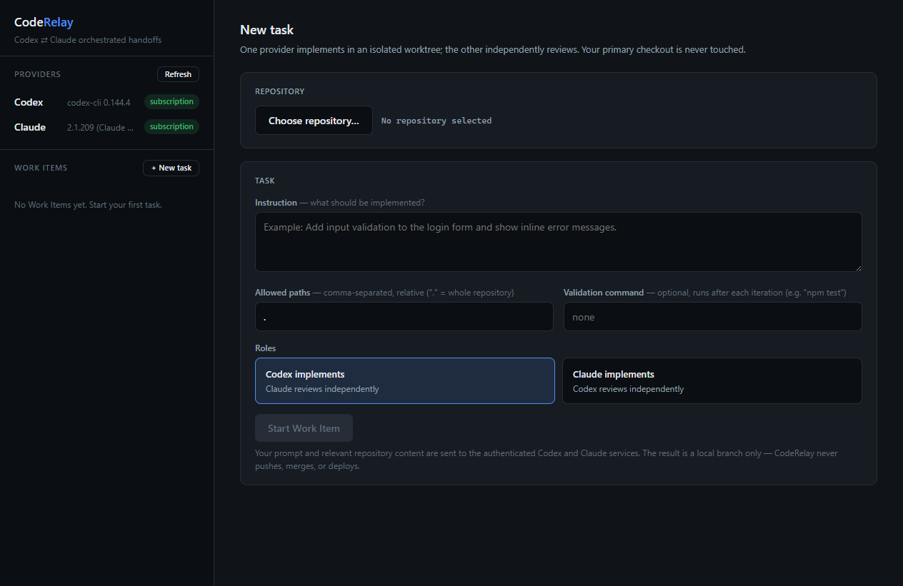

# CodeRelay

CodeRelay is a local desktop application for structured Worker/Auditor handoffs between the separately installed official Codex and Claude Code command-line tools. One provider implements a task inside an isolated Git worktree; the other independently reviews it. The orchestrator is the sole validation authority, the primary checkout is never touched, and nothing is ever pushed, merged, or deployed.



> CodeRelay is an independent open-source project and is not affiliated with, endorsed by, or sponsored by OpenAI or Anthropic.

> CodeRelay does not bundle Codex or Claude Code. Users install and authenticate the official command-line tools separately.

## Desktop app

```powershell
npm install
npm run app
```

The app follows the four-layer architecture in [`docs/PRODUCT-SPEC.md`](docs/PRODUCT-SPEC.md): a React renderer, a sandboxed Zod-validated preload IPC layer, the Electron main process, and a separate orchestration utility process that owns SQLite, Git worktrees, provider processes, validation, and enforcement. Pick a clean repository, describe a task, choose which provider implements, and watch the live handoff timeline. The result is an isolated local `coderelay/…` branch you review and merge yourself.

## Current boundary

The Windows technical proof (Milestones 0–2) passed with real providers, and the maintainer recorded `CONDITIONAL_GO` on 2026-07-17 with all named conditions resolved the same day — see [`docs/decisions/MILESTONE-2.md`](docs/decisions/MILESTONE-2.md). Development of the desktop UI is authorized and in progress.

Still out of scope until release engineering begins: macOS implementation, installers, signing, notarization, and automatic updates.

## Requirements

- Windows 10 or newer for real-provider Milestone 2 certification.
- Node.js 24.14.1, pinned for the Windows technical proof phase.
- Git.
- For real handoffs only: separately installed official `codex` and `claude` CLIs, each authenticated with a qualifying subscription. API-key or metered Console/API authentication is rejected.

## Development

```powershell
npm install
npm run check
npm run probe
npm run prototype
npm run app
```

`npm run probe` records a redacted local capability report under `evidence/local/`. `npm run prototype` uses stub providers and does not contact OpenAI or Anthropic. `npm run milestone2` fails closed unless both providers are available, capability-proven, and normalized as `SUBSCRIPTION_VERIFIED`.

The authoritative product and security contracts live in [`docs/`](docs/). Contributor setup and safety rules are in [`CONTRIBUTING.md`](CONTRIBUTING.md) and [`SECURITY.md`](SECURITY.md).

## Privacy

CodeRelay has no telemetry, uploads no crash reports without consent, and stores no provider credentials. Real provider turns send prompts and relevant source code through the authenticated Codex and Claude services. The command environment is constructed from an allowlist and excludes API keys, cloud credentials, alternate endpoints, and unrelated environment variables.

## License

Apache License 2.0. See [`LICENSE`](LICENSE) and [`NOTICE`](NOTICE).
